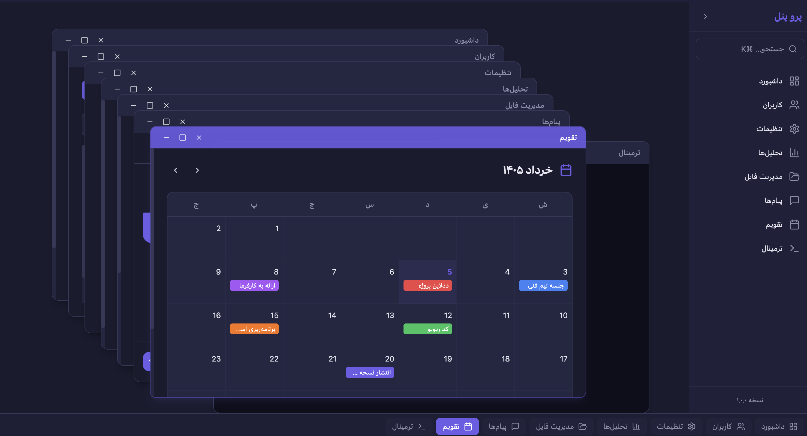

# Pro Panel — Web Desktop Admin Panel

A modern MDI (Multiple Document Interface) admin panel that simulates a desktop operating system experience in the browser. Instead of traditional page routing, every feature opens inside a floating, draggable, and resizable window.



## Tech Stack

| Layer | Technology |
|---|---|
| Build Tool | Vite 6 |
| UI Framework | React 19 + TypeScript |
| State Management | Zustand 5 (with `persist` middleware) |
| Window Drag/Resize | react-rnd |
| Styling | Tailwind CSS 3 |
| Icons | Lucide React |
| Command Palette | cmdk |
| Keyboard Shortcuts | react-hotkeys-hook |
| Toast Notifications | sonner |
| Error Boundaries | react-error-boundary |
| Inter-Window Events | mitt |
| Context Menus | @radix-ui/react-context-menu |

## Features

### Window Management System

The core of the application — a full MDI window manager powered by Zustand and react-rnd.

- **Open** — windows open via the sidebar or command palette, with automatic cascade positioning so they don't stack on top of each other.
- **Close** — clicking the X button removes the window from state and auto-focuses the next visible window.
- **Minimize** — hides the window from the desktop while keeping it alive in the taskbar. Focus passes to the next top-most window.
- **Maximize / Restore** — double-clicking the title bar or clicking the maximize button expands the window to fill the entire desktop area. Clicking restore returns it to its previous position and size.
- **Focus (z-index stacking)** — clicking anywhere on a window brings it to the front by bumping its z-index. The active window gets a purple accent border and title bar.
- **Drag** — the title bar acts as the drag handle. Windows can be moved freely within the desktop bounds.
- **Resize** — all window edges and corners are resizable with a minimum size of 400x300px.
- **Duplicate prevention** — opening an already-open window focuses and un-minimizes it instead of creating a duplicate.
- **Close All** — a "بستن همه" button on the taskbar clears all open windows in one click, resetting the desktop to its empty state.

### Sidebar (RTL)

A collapsible right-side navigation panel (natural position for RTL layouts).

- Lists all available "applications" with Lucide icons.
- Clicking a menu item triggers `openWindow` — no route changes.
- Collapse toggle shrinks the sidebar to icon-only mode (64px).
- Built-in search trigger that opens the command palette.

### Taskbar

A Windows-style taskbar pinned to the bottom of the screen.

- Displays all currently open windows with their icon and title.
- Clicking a focused window minimizes it.
- Clicking a minimized window restores it.
- Clicking a background window brings it to focus.
- Minimized windows show a subtle opacity indicator.

### Command Palette (cmdk)

A Spotlight-like search overlay for rapid window switching.

- Activated globally via `Cmd+K` (macOS) or `Ctrl+K` (Windows/Linux).
- Closes on `Escape` or clicking the backdrop.
- Searches through all currently open windows by title and component name.
- Selecting a result restores the window (if minimized) and focuses it.
- Shows a "minimized" badge on windows that are hidden.

### Miller Columns (App Explorer)

A macOS Finder-style navigation pattern for exploring deeply nested menus (N-level).

- **RTL flow** — columns scroll right-to-left. The root column is pinned to the far right; child columns open to the left.
- **Root column** — contains a search input, a "Pinned Apps" (favorites) section, and all root-level categories.
- **Branch navigation** — clicking a menu item with children opens a new column showing those children. A left-pointing arrow (⬅) indicates expandable items.
- **Terminal nodes** — clicking an item with a `componentName` opens it as a floating window.
- **Search** — the root column's search bar flattens the entire menu tree and instantly shows matching terminal apps.
- **Favorites / Pinned Apps** — terminal items show a star icon (⭐) on hover. Clicking toggles the pin. Pinned apps appear in the root column's "علاقه‌مندی‌ها" section and are persisted in `localStorage`.
- **Auto-scroll** — the container automatically scrolls to the newest column when navigating deeper.
- **Custom scrollbar** — thin 5px scrollbar that fades in on hover, matching the desktop theme.
- **4-level deep mock data** — 10 root categories with up to 4 levels of nesting (e.g. Users → Roles → Permissions → Read/Write/Admin).

### Window Snapping (Windows 11 style)

Dragging a window to a screen edge triggers a snap.

- **Left edge** (x ≤ 20px) — window snaps to the left 50% of the desktop area.
- **Right edge** (x ≥ parent width - window width - 20px) — window snaps to the right 50%.
- **Pre-snap restore** — the previous dimensions are saved. Dragging the window away from the edge restores its original size.
- **Manual resize clears snap** — resizing a snapped window resets the snap state.

### Show Desktop

A toggle button on the taskbar (🖥️ دسکتاپ) minimizes all windows at once. Clicking it again restores all windows to their previous state and focuses the top-most one.

### Pop-out Window (Multi-monitor)

Each window header includes a pop-out button (↗). Clicking it opens the component in a real browser tab via `window.open('/popout.html?component=ComponentName', '_blank')`, closes the floating window, and shows a toast notification. The popout page is a standalone entry point (`src/popout.tsx`) that reads the component name from URL params and renders it directly with lazy loading.

### Workspace Persistence (Zustand persist)

The Zustand store is wrapped with `persist` middleware. The following data is serialized to `localStorage`:

- Window positions, sizes, z-index, minimized/maximized state
- Active window ID
- Theme mode and wallpaper URL
- Pinned/favorite app IDs

React components and functions are excluded from serialization via `partialize`.

### Toast Notifications (sonner)

Global toast notifications for user actions:

- Window snapped to edge
- Window popped out to new tab
- Window closed/minimized via keyboard shortcut
- Show Desktop toggled
- Dark-themed toasts positioned at bottom-left with RTL direction.

### Keyboard Shortcuts (react-hotkeys-hook)

Global hotkeys that work across the entire application:

| Shortcut | Action |
|---|---|
| `Cmd+K` / `Ctrl+K` | Toggle command palette |
| `Alt+W` | Close the currently focused window |
| `Alt+M` | Minimize the currently focused window |
| `Alt+D` | Toggle Show Desktop |
| `Escape` | Close command palette |

### Window-Level Error Boundaries (react-error-boundary)

Each floating window is wrapped with its own `<ErrorBoundary>`. If a specific app crashes, only that window displays the error fallback — the rest of the Web Desktop stays fully functional.

- **Isolated errors** — a crash in Dashboard doesn't affect Users, Settings, or any other window.
- **Error fallback UI** — shows an alert icon, the error message in a monospace code block, and a "تلاش مجدد" (Try Again) button that resets the boundary.
- **Retry** — clicking "Try Again" unmounts and remounts the crashed component, giving it a fresh start.

### Inter-Window Communication (mitt Event Bus)

A typed event bus powered by `mitt` enables isolated floating windows to communicate with each other.

- **Typed events** — `REFRESH_DATA`, `NOTIFY`, and `DATA_SYNC` events with strongly typed payloads.
- **Custom hooks** — `useEventBus(event, handler)` subscribes with automatic cleanup on unmount. `useEmit(event)` returns a stable emit function.
- **Use case** — Window A adds a user → emits `REFRESH_DATA { target: "users" }` → Window B (Users list) listens and refetches its data.

```ts
// Emitting from one window
const emitRefresh = useEmit("REFRESH_DATA");
emitRefresh({ target: "users" });

// Listening in another window
useEventBus("REFRESH_DATA", (payload) => {
  if (payload.target === "users") refetch();
});
```

### Role-Based Access Control (RBAC)

A simple but effective RBAC system controls which apps and menu items each user role can access.

- **Roles** — `ADMIN`, `EDITOR`, `VIEWER`. Default is ADMIN for demo purposes.
- **Auth store** — Zustand store with `login(role)`, `logout()`, `switchRole(role)`, and `hasAccess(allowedRoles)`. Persisted in `localStorage`.
- **MenuItem integration** — the `MenuItem` type includes an optional `allowedRoles?: string[]` field. Empty/undefined means accessible to all.
- **Filtered everywhere** — the Miller Columns (App Explorer), Command Palette, and menu tree all filter items by the current user's role before rendering.
- **Restricted items** (examples):
  - Users → Roles & Permissions: ADMIN only
  - Add User: ADMIN + EDITOR
  - Settings → Security: ADMIN only
  - Infrastructure: ADMIN only
  - Terminal app: ADMIN only

### OS-Level Context Menus (Radix UI)

Right-click context menus using `@radix-ui/react-context-menu` with full RTL support.

- **Desktop background** — right-click the main desktop area to access:
  - "نمایش دسکتاپ" (Show Desktop)
  - "بستن همه پنجره‌ها" (Close All Windows)
  - "تغییر والپیپر" (Change Wallpaper) — submenu with 4 gradient presets + default
- **Taskbar items** — right-click any window's icon in the taskbar to access:
  - "فوکوس" (Focus) — bring window to front
  - "حداقل کردن" / "بازگردانی" (Minimize / Restore) — toggle minimize state
  - "بستن" (Close) — close the window
- Menus are styled with Tailwind, support RTL direction (`dir="rtl"`), and render at `z-index: 9999` to stay above all windows.

### Responsive Degradation (Mobile)

The application adapts to mobile viewports (< 768px) with a simplified, touch-friendly layout.

- **`useIsMobile` hook** — uses `useSyncExternalStore` for tear-free reactive viewport width detection.
- **Full-screen windows** — on mobile, `react-rnd` is bypassed. Windows render as `fixed inset-0` modals covering the entire viewport with no drag or resize.
- **Mobile header** — each window gets a simplified header with a back arrow (→) and the window title centered. Only the close action is available.
- **Hidden chrome** — the Sidebar, Taskbar, and desktop background pattern are hidden on mobile to maximize content area.
- **Mobile app launcher** — when no windows are open on mobile, a grid of app buttons is shown for easy touch access.
- **Toast position** — notifications move from bottom-left (desktop) to top-center (mobile).

### RTL (Right-to-Left) Layout

The entire application is built RTL-first.

- `<html dir="rtl">` on the root element.
- Sidebar positioned on the right side.
- All text, tables, forms, and navigation flows right-to-left.
- Persian (Farsi) used throughout the UI labels and content.

### Component Registry & Lazy Loading

A clean mapping pattern for registering window content.

- `componentRegistry` maps string names to `React.lazy()` components.
- Window bodies are wrapped in `<Suspense>` with a shimmering `<WindowSkeleton />` fallback.
- Adding a new window type requires only: (1) create the component, (2) add an entry to the registry, (3) add a definition to `windowDefinitions`.

### 8 Built-in Window Applications

Each window is a self-contained React component with realistic UI.

| Window | Description |
|---|---|
| **Dashboard** | Stats cards (users, sales, revenue, live visitors) + monthly sales bar chart |
| **Users** | Searchable user table with roles, status badges, and a "new user" button |
| **Settings** | Side-navigated settings panel with dark mode, notifications, and RTL toggles |
| **Analytics** | Metric cards with trend indicators + weekly traffic bar chart |
| **File Manager** | Folder grid with file counts + recent files list with sizes and dates |
| **Messages** | Split-pane chat UI with contact list, unread badges, and message bubbles |
| **Calendar** | Monthly calendar grid with Persian day names and color-coded events |
| **Terminal** | Interactive terminal emulator with command history (help, ls, pwd, whoami, date, echo, clear) |
| **App Explorer** | Miller Columns (Finder-style) navigation for exploring nested menu hierarchies with search and favorites |

### Theming & Styling

- Custom dark color palette defined in `tailwind.config.ts` under `colors.desktop.*`.
- Custom scrollbar styling for WebKit browsers.
- cmdk overrides styled to match the desktop theme.
- Subtle dot-grid background pattern on the desktop area.
- Smooth transitions on window focus, sidebar collapse, and interactive elements.

## Project Structure

```
pro-panel/
├── index.html                     # RTL HTML shell
├── popout.html                    # Popout window HTML shell
├── package.json
├── vite.config.ts                 # Vite + path aliases
├── tailwind.config.ts             # Custom desktop color palette
├── postcss.config.js
├── tsconfig.json
└── src/
    ├── main.tsx                   # React entry point
    ├── popout.tsx                 # Popout window entry point (reads ?component= from URL)
    ├── App.tsx                    # Root layout (sidebar + desktop + taskbar + palette)
    ├── vite-env.d.ts
    ├── styles/
    │   └── globals.css            # Tailwind directives + cmdk/scrollbar styles
    ├── store/
    │   ├── types.ts               # WindowType, OpenWindowParams interfaces
    │   ├── useWindowStore.ts      # Zustand store with all window actions (persisted)
    │   ├── authStore.ts           # Auth store with roles (ADMIN/EDITOR/VIEWER), persisted
    │   └── index.ts               # Barrel export
    ├── lib/
    │   ├── eventBus.ts            # mitt event bus with typed events
    │   ├── useEventBus.ts         # useEventBus + useEmit hooks
    │   ├── rbac.ts                # filterMenuByRole() + flattenFilteredTerminalItems()
    │   └── useIsMobile.ts         # useIsMobile() viewport width hook
    ├── components/
    │   ├── registry.ts            # Component registry + window definitions (with RBAC)
    │   ├── DynamicWindow.tsx      # react-rnd wrapper (snap, pop-out, error boundary, mobile)
    │   ├── Sidebar.tsx            # Collapsible RTL navigation sidebar
    │   ├── Taskbar.tsx            # Bottom taskbar (Show Desktop, Close All, context menu)
    │   ├── CommandPalette.tsx     # cmdk overlay (filtered by role)
    │   ├── GlobalShortcuts.tsx    # react-hotkeys-hook global keyboard shortcuts
    │   ├── WindowSkeleton.tsx     # Shimmering skeleton for Suspense fallback
    │   ├── WindowErrorFallback.tsx # Error boundary fallback with retry button
    │   ├── DesktopContextMenu.tsx # Radix right-click menu (wallpaper, show desktop, close all)
    │   └── TaskbarContextMenu.tsx # Radix right-click menu per taskbar item
    ├── explorer/
    │   ├── types.ts               # MenuItem recursive type + MillerColumn type
    │   ├── menuData.ts            # 4-level deep mock menu tree + flattenTerminalItems()
    │   ├── useMillerColumns.ts    # Hook: path state, columns derivation, search filtering
    │   ├── MillerColumnItem.tsx   # Single item row (icon, title, pin, arrow)
    │   ├── MillerColumn.tsx       # Column container (header + scrollable list)
    │   └── AppExplorer.tsx        # Main Miller Columns component (root + child columns)
    └── windows/
        ├── Dashboard.tsx
        ├── Users.tsx
        ├── Settings.tsx
        ├── Analytics.tsx
        ├── FileManager.tsx
        ├── Messages.tsx
        ├── Calendar.tsx
        └── Terminal.tsx
```

## Getting Started

```bash
# Install dependencies
pnpm install

# Start dev server
pnpm dev

# Build for production
pnpm build

# Preview production build
pnpm preview
```

## How to Add a New Window

1. Create a new component in `src/windows/YourApp.tsx`:

```tsx
export default function YourApp() {
  return <div dir="rtl">Your content here</div>;
}
```

2. Register it in `src/components/registry.ts`:

```ts
// Add to componentRegistry
YourApp: lazy(() => import("../windows/YourApp")),

// Add to windowDefinitions
{ id: "your-app", title: "عنوان", componentName: "YourApp", icon: "IconName" },
```

That's it — the sidebar, taskbar, command palette, and app explorer will automatically pick it up.

## License

MIT
